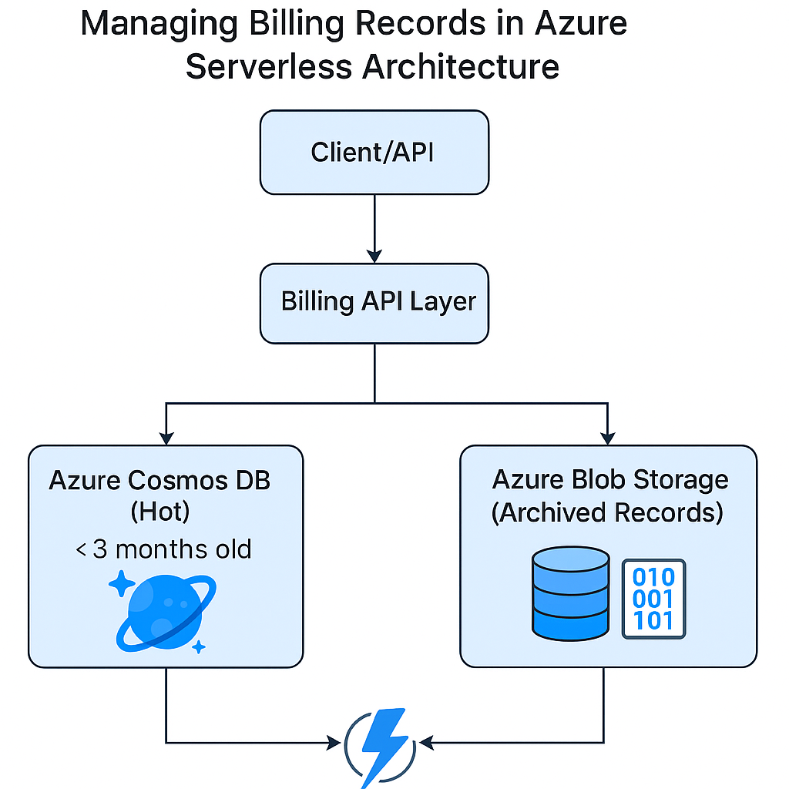

# Azure Billing Archival

This solution archives billing records older than 3 months from Azure Cosmos DB to Azure Blob Storage to optimize cost while preserving API behavior.

## Architecture



## Components

- `functions/`: Azure Function that archives records
- `billing_api/`: Billing service logic with Cosmos + Blob fallback
- `infra/`: Bicep template to deploy Blob, Cosmos, Function
- `scripts/`: Manual blob readers for testing/debugging

## How It Works

- A timer-triggered Azure Function moves old records to Blob and deletes them from Cosmos DB.
- Read operations first check Cosmos; if not found, fallback to Blob.

## Deployment

```bash
az deployment group create --resource-group YOUR_RG --template-file infra/main.bicep
```

## Schedule

Function runs weekly. You can configure in `function.json`.

## Requirements

- Azure Function App
- Azure Cosmos DB
- Azure Blob Storage

## License

MIT
